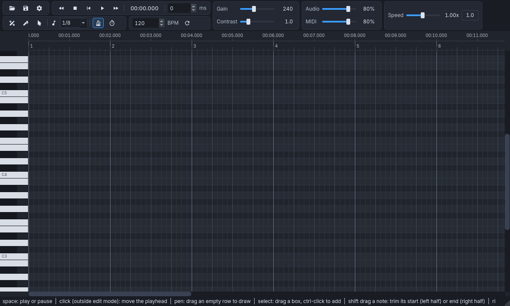
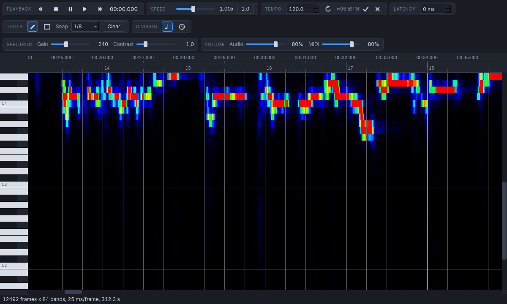

# Namioto

A FL Studio style MIDI note editor built with PyQt6: time on the horizontal axis, pitch on the
vertical axis, and notes you can draw, move, resize, and delete.

The name is a pun on *WaveTone*: 波音 (*namioto*, "sound of waves") is a literal Japanese
translation of *wave* + *tone*.



## Requirements

- [uv](https://docs.astral.sh/uv/) (Python 3.12 or newer)

## Run

```bash
uv run namioto                            # the editor
uv run namioto song.mp3                   # the editor with the audio analysed into a spectrum
uv run namioto song.mp3 --channels both --gain 300   # analysis options
uv run namioto-tempo song.mp3             # estimate the tempo of a file (beat tracking + fit)
uv run namioto-tempo song.mp3 --local     # per-window estimates, 12 s wide, 6 s apart
uv run namioto-tempo song.mp3 --json      # machine readable, includes every beat
uv run namioto-tempocnn song.mp3          # the same with the TempoCNN model (runner-up)
uv run namioto-spectrum song.mp3          # analyse into 84 note bands (C1-B7)
uv run namioto-spectrum song.mp3 --bench  # plus per-stage timings
uv run namioto-spectrum song.mp3 --threshold 1.2   # plus auto-filled note spans
uv run pytest                             # tests
uv run scripts/bench_spectrum.py          # spectrum benchmark
```

`uv` creates the virtual environment and installs the dependencies, including the bundled
TempoCNN model used by `namioto-tempocnn` and `namioto.tempo`, on first run.

## Spectrum

Passing an audio file draws its note-domain spectrum behind the piano roll, the way noteDigger and
WaveTone show it: one column per 25 ms frame (40 frames per second), one row per note band (C1 to B7),
coloured from dark
blue through green to red as the energy rises, with the octave lines of the pitch axis. The
**Spectrum** block sets the two display parameters — gain (how much energy reaches full red) and
contrast (the exponent applied to the energy). The analysis runs in a background thread and reports
progress in the status bar; `--channels` picks the channels to analyse (mono, left, right, sum,
side, both), `--t-num` the frames per second.



## Build

```bash
./build.sh wheel   # sdist + wheel             -> dist/*.whl, dist/*.tar.gz
./build.sh cli     # frozen tempo CLI          -> dist/namioto-tempo/
./build.sh cli spectrum                        # -> dist/namioto-spectrum/
./build.sh app     # frozen editor             -> dist/namioto/
./build.sh all
./build.sh clean
```

The ONNX model ships as package data: `uv build` puts it in the wheel, and the PyInstaller
targets collect it with `--collect-data namioto.models`. Bundled third-party models carry their
own license — see [namioto/models/README.md](namioto/models/README.md).

## Layout

```
namioto/beats.py      tempo estimation by beat tracking (librosa) + least-squares fit, no Qt
namioto/tempo.py      TempoCNN tempo estimation (ONNX Runtime) + tempo map helpers, no Qt
namioto/spectrum.py   note-domain spectrum analysis (STFT → 84 note bands), no Qt
namioto/playback.py   note synthesis: pitches rendered into one audio buffer, no Qt
namioto/models/       bundled ONNX models
namioto/ui/           PyQt6 editor (app.py: window, controls.py: control bars, roll.py: widgets,
                      spectrogram.py: spectrum colour map, image cache and loader,
                      audio.py: note playback outputs - an external MIDI synth or the built-in one)
tests/                pytest
scripts/              developer tools (spectrum benchmark)
build.sh              packaging script
```

## License

Namioto is licensed under the **GNU Affero General Public License v3.0** — see [LICENSE](LICENSE).
The AGPL is required because the program reuses code from the GPL-3.0 licensed NoteDigger
project, reimplements the AGPL-3.0 licensed Essentia TempoCNN front end, and links PyQt6
(GPL-3.0 or commercial). See [NOTICE](NOTICE) for the full reasoning and the attributions.

The bundled tempo model is **not** AGPL: `namioto/models/deeptemp-k16-3.onnx` comes from
Essentia/TempoCNN and is licensed **CC BY-NC-SA 4.0** (attribution, non-commercial,
share-alike) — see [namioto/models/README.md](namioto/models/README.md). Builds that ship this
file are therefore non-commercial; drop the model or replace it to distribute commercially.

## Controls

The window has three control bars, each split into captioned blocks of related controls
(WaveTone's grouping):

| Bar | Blocks |
| --- | --- |
| Transport | **Playback** (rewind, stop, pause, play, forward, position readout), **Speed** (0.25x-2.00x with a `1.0` reset), **Tempo** (BPM, plus the estimated tempo of the audio), **Latency** (ms) |
| Edit | **Tools** (edit mode, pen, select, snap grid, clear), **Division** (note icon = the grid follows the beats of the tempo map, clock icon = it follows seconds) |
| Mix | **Spectrum** (gain, contrast), **Volume** (audio, MIDI) |

The tool buttons, the snap grid, the division, the tempo estimate, the transport and the two
spectrum display parameters drive the editor so far; the **Audio** volume slider is still a
placeholder — the analysed audio itself cannot be played yet.

| Action | Input |
| --- | --- |
| Edit mode | The button in front of the tools: notes can only be drawn, moved, resized and selected while it is on. Picking the pen or the select tool turns it on as well, entering the mode starts on the pen, and the snap grid and the clear button are only usable inside it |
| Draw note | Pen tool: left drag on the empty grid (drag either way to set the length) |
| Move note(s) | Left drag a note |
| Resize note | Left drag the right edge of a note, or Shift + left drag anywhere on it: its left half moves the start, its right half the end |
| Select note | Left click |
| Add to selection | Ctrl + left click |
| Box select | Select tool: left drag on the grid, or Ctrl + left drag with either tool |
| Select all | Ctrl + A |
| Delete | Right click a note, or Delete / Backspace for the selection |
| Cancel a drag | Escape |
| Double / halve the tempo | Right-click the Tempo field, or press `*` / `/` while it has the focus |
| Pan | Middle drag, a scrollbar, or drag in the timeline ruler to scroll horizontally |
| Zoom time | Ctrl + wheel |
| Zoom pitch | Ctrl + Shift + wheel |
| Scroll | Wheel along the timeline, Shift + wheel up and down the pitches |

Loading an audio file also estimates its tempo in the background (beat tracking plus a
least-squares fit over the beats, ~1 s for a whole song). It never changes the tempo by itself:
when it is done, the **Tempo** block shows a suggestion such as `≈93 BPM` next to the BPM field,
dimmed while few of its 12 s windows agree, with a tick to use it and a cross to drop it. Typing a
tempo, dropping the suggestion or loading another file discards it; the round arrow estimates again.
Changing the tempo never re-times the notes: they are timed against the audio, so only the beat
grid re-divides underneath them (and the roll keeps the audio at the same scale on screen, which is
how the notes stay where they are relative to the spectrum and to the time ruler).
The TempoCNN model (`namioto/tempo.py`, `namioto-tempocnn`) is kept as the runner-up: it is strong on
full mixes but its 256 integer-BPM classes and its training data (full mixes only) make it a poor
fit for stems, where beat tracking wins.

The transport plays the notes. They go to a **software MIDI synth** when one is listening on the
MIDI bus - TiMidity and FluidSynth are recognised by name, and the tooltip of the **MIDI** slider
says which one is in use, because that is where the sound comes from (patches included). Without
one, the notes are rendered by a small additive synth inside the program and streamed through Qt's
audio output instead. **Speed** scales the timeline without changing the pitch, **Latency** nudges
the position readout, and the playhead follows the clock. Clicking a key on the keyboard or a note
in the roll auditions it. Hovering the roll while editing highlights the row under the mouse
together with its octave and twelfth the way WaveTone does, paints those keys red and shows the
note name and frequency next to the status bar; outside edit mode the roll is a plain view of the
spectrum and the notes.

The **Snap** combo sets the quantisation applied when drawing, moving, and resizing notes, and
**Clear** removes every note. The **Division** buttons change how the time axis is divided — into
beats and bars of the tempo map, or into a 1-2-5 ladder of seconds — and nothing else: the ruler
shows the clock above the measure numbers under either of them.
