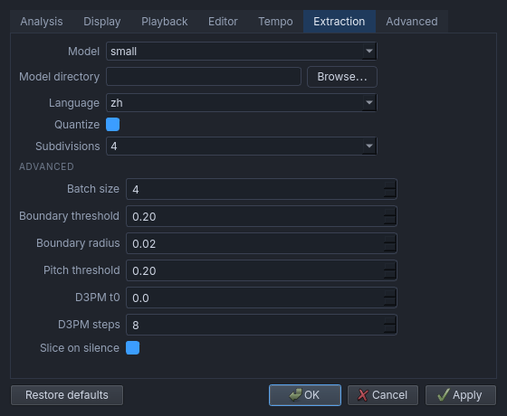

# Namioto

An open-source editor that follows [WaveTone](https://ackiesound.ifdef.jp/)'s feature set: analyse an
audio file into a note-domain spectrum, draw that behind a piano roll, then transcribe what you see
into notes - time on the horizontal axis, pitch on the vertical axis, with notes you can draw, move,
resize and delete. Notes play back through a MIDI synth or the built-in one, and the file plays along
with them.


## Requirements

- [uv](https://docs.astral.sh/uv/) (Python 3.12 or newer)

## Run

```bash
uv run namioto                            # the editor
uv run namioto song.mp3                   # the editor with the audio analysed into a spectrum
uv run namioto song.nto                   # open a project
uv run namioto song.mid                   # open a MIDI file (or import one over an audio file)
uv run namioto song.mp3 --channels both --gain 300   # analysis options
uv run namioto-tempo song.mp3             # estimate the tempo of a file (beat tracking + fit)
uv run namioto-tempo song.mp3 --local     # per-window estimates, 12 s wide, 6 s apart
uv run namioto-tempo song.mp3 --json      # machine readable, includes every beat
uv run namioto-tempocnn song.mp3          # the same with the TempoCNN model (runner-up)
uv run namioto-spectrum song.mp3          # analyse into 84 note bands (C1-B7)
uv run namioto-spectrum song.mp3 --bench  # plus per-stage timings
uv run namioto-spectrum song.mp3 --threshold 1.2   # plus auto-filled note spans
uv run namioto-game song.mp3 --model DIR  # extract the notes of a singing voice (GAME's models)
uv run pytest                             # tests
uv run scripts/bench_spectrum.py          # spectrum benchmark
```

`uv` creates the virtual environment and installs the dependencies, including the bundled
TempoCNN model used by `namioto-tempocnn` and `namioto.tempo`, on first run.

## Spectrum

Passing an audio file draws its note-domain spectrum behind the piano roll, the way noteDigger and
WaveTone show it: one column per 25 ms frame (40 frames per second), one row per note band (C1 to B7),
coloured from dark
blue through green to red as the energy rises, with the octave lines of the pitch axis. The
**Spectrum** block sets the two display parameters — gain (how much energy reaches full red) and
contrast (the exponent applied to the energy). The analysis runs in a background thread and reports
progress in the status bar; `--channels` picks the channels to analyse (mono, left, right, sum,
side, both), `--t-num` the frames per second.


## Projects

The **Project** block of the transport row holds `Open` and `Save` (`Ctrl+O`, `Ctrl+S`, `Ctrl+Shift+S`
for Save As), and `Export MIDI` beside them for a MIDI file of its own. A `.nto` project is a plain
JSON file that keeps the notes together with what they were drawn over and the values that belong to
that piece of work: the audio file, the tempo, the analysis parameters, the spectrum display, the snap
grid and the view. It is a few kilobytes, so it is diffable, searchable and editable by hand.

Notes are kept in seconds, so a different tempo moves the grid and never the notes, and the file
lists them in time order. The audio is recorded as a path - relative to the project when it sits
beside it - and never copied into the project. A project whose audio is missing still opens, since
the notes are worth having, and says so in the status bar.

The window title shows the project name, with a `*` while there are unsaved changes; closing, or
opening another project, asks before they are lost. Moving the view, or turning a volume down, is
written when you save but does not count as a change, so looking around never nags. A roll that has
not been saved under a name yet is treated as a sketch and closes without asking.

Settings and projects stay apart: the values inside a project belong to that project and never
overwrite the program's own defaults, which are what the next file starts from.

## MIDI files

`Open` (`Ctrl+O`) takes a `.mid`/`.midi` file as well as a project, and `Export MIDI` writes the roll
out for a DAW, a score program or a synth, saving the project separately. A MIDI is read by channel:
every MIDI channel with notes in it becomes one channel here, carrying its instrument and channel
volume, and one track chunk holding several channels is read as several. A channel carries no name -
a name belongs to a track chunk, which may hold any number of channels - so names live in the project
file only, and none is read from or written to MIDI. Importing into a window that already has audio
loaded keeps the audio, the view and the snap grid, which is how a transcription made elsewhere is
checked against the sound it came from; what it cannot use (a note that never ends, a channel past the
sixteenth, a tempo change after the first, since the grid holds one tempo) is counted in the
status bar rather than dropped silently. An import over a roll that already has notes asks first, and
along with **Replace** it offers **Merge**: each of the file's channels is pointed at one of the
roll's channels or at a new one. The file's i-th channel starts on the roll's i-th channel while that
one carries no notes, and the ones whose place is taken fill the empty channels left, in order, so
the notes arriving are added to a channel of their own rather than mixed into one already in use; the
mapping is edited in the same dialog, and the tempo stays where the audio put it.

**Export MIDI** asks for one thing only, the file name, and writes every channel on the project's own
tempo, one track chunk per channel and no name on any of them. A note drawn on the roll's grid lands
exactly on the tick that grid names, and one taken from the audio keeps the time it has, rounded to
the nearest tick; a hidden channel goes in like any other, since hiding is about the drawing and not
the notes. **WaveTone compatibility**, in the settings, is
on by default: WaveTone's own MIDI export starts every note one bar late, so a file it wrote is read
back with that bar removed, and a file written here carries it again - which is what its own tools
expect. Turn it off to exchange plain MIDI with anything else,
since a file whose notes start before that bar was never WaveTone's and is read as it stands.

## Settings

The gear at the right end of the Mix row opens the settings window, and it is short on purpose: it
holds only what has no control in the bars - the analysis parameters (channels, frames per second,
FFT size, A4), the two windows the beat tracker fits, and **WaveTone compatibility** - a page per
group, with the beat tracker's tuning under an `ADVANCED` heading. `Restore defaults` puts everything
back, and `Apply` lets the change go live without closing the window. Analysis parameters reach the
spectrum the next time a file is loaded, and the Analysis page has a `Re-analyse now` button for
jumping the gun.



Everything else is remembered rather than configured. The gain, the contrast, the audio and MIDI
volumes, the speed, the snap grid, the division, the zoom, the two switches beside the transport
readout and the window's own size and position are written to `~/.config/namioto/settings.json`
(`$NAMIOTO_SETTINGS` points somewhere else) as they change on screen, and are back the way they were
next time. The tempo and the latency are not among them: they describe one song, so they start from
their defaults (120 BPM, 0 ms) whenever another file is loaded, and a project carries them - opening
it puts its own back. The file is plain JSON, so it can be edited by hand - and a hand-mangled or
half-written one falls back to the defaults field by field instead of refusing to start.

The command line still wins for one run: `--channels`, `--t-num`, `--gain` and `--contrast` shape
this run alone and are never written back into the file.

## Build

```bash
./build.sh wheel   # sdist + wheel             -> dist/*.whl, dist/*.tar.gz
./build.sh cli     # frozen tempo CLI          -> dist/namioto-tempo/
./build.sh cli spectrum                        # -> dist/namioto-spectrum/
./build.sh app     # frozen editor             -> dist/namioto/
./build.sh all
./build.sh clean
```

The ONNX model ships as package data: `uv build` puts it in the wheel, and the PyInstaller
targets collect it with `--collect-data namioto.models`. Bundled third-party models carry their
own license — see [namioto/models/README.md](namioto/models/README.md).

## Layout

```
namioto/beats.py      tempo estimation by beat tracking (librosa) + least-squares fit, no Qt
namioto/tempo.py      TempoCNN tempo estimation (ONNX Runtime) + tempo map helpers, no Qt
namioto/spectrum.py   note-domain spectrum analysis (STFT → 84 note bands), no Qt
namioto/playback.py   note synthesis: pitches rendered into one audio buffer, no Qt
namioto/channels.py   the MIDI channels a note plays on, and the values they play with, no Qt
namioto/interaction.py the roll's normal/edit mode and its tool, as one value, no Qt
namioto/document.py   the notes and the MIDI channels they play on, in beats, no Qt
namioto/midi.py       reading and writing MIDI files (mido), no Qt
namioto/models/       bundled ONNX models
namioto/ui/           PyQt6 editor (app.py: window, controls.py: control bars, roll.py: widgets,
                      spectrogram.py: spectrum colour map, image cache and loader,
                      audio.py: note playback outputs - an external MIDI synth or the built-in one,
                      song.py: the audio file streamed to Qt's audio output)
tests/                pytest
scripts/              developer tools (spectrum benchmark)
build.sh              packaging script
```

## License

Namioto is licensed under the **GNU Affero General Public License v3.0** — see [LICENSE](LICENSE).
The AGPL is required because the program reuses code from the GPL-3.0 licensed NoteDigger
project, reimplements the AGPL-3.0 licensed Essentia TempoCNN front end, and links PyQt6
(GPL-3.0 or commercial). See [NOTICE](NOTICE) for the full reasoning and the attributions.

The bundled tempo model is **not** AGPL: `namioto/models/deeptemp-k16-3.onnx` comes from
Essentia/TempoCNN and is licensed **CC BY-NC-SA 4.0** (attribution, non-commercial,
share-alike) — see [namioto/models/README.md](namioto/models/README.md). Builds that ship this
file are therefore non-commercial; drop the model or replace it to distribute commercially.

## Controls

The window has three control bars, each split into captioned blocks of related controls
(WaveTone's grouping):

| Bar | Blocks |
| --- | --- |
| Transport | **Project** (open, save, export MIDI), **Playback** (rewind, stop, play from the beginning, play/pause, forward, position readout, auto page turn, overtone highlight), **Speed** (0.10x-2.00x in 5% steps, pitch unchanged, with a reset icon back to 1.00x), **Tempo** (BPM, the estimated tempo of the audio, and the latency in ms) |
| Edit | **Tools** (edit mode, channel sidebar, pen, select, snap grid), **Division** (the metronome icon: checked, the grid follows the beats of the tempo map; unchecked, it follows seconds) |
| Mix | **Spectrum** (gain, contrast), **Volume** (**Audio** for the file, **MIDI** for the notes), and the gear that opens the settings window (the analysis parameters and the few options the bars do not hold) |

**Volume** has a slider for each layer: the audio file is streamed at the level of the first one, and
the second is the note playback - a scale factor for the built-in synth, and control change 7 (channel
volume) for an external one, which does its own mixing.

**Channels** are toggled by the layers icon in the tools: a sidebar with one card per MIDI channel.
The notes of each channel are painted in its colour, and the card holds the name (double-click to
rename), the GM instrument the channel plays, and the lock, show and mute switches. Clicking a card
makes it the drawing channel; the context menu adds a channel, sets its volume or deletes it (the
last one stays). Deleting one leaves the numbers of the others alone, so a note keeps the MIDI
channel it plays on. Any of the sixteen can be used, percussion included.
A locked channel cannot be edited, a hidden one is not drawn, and a muted one stays silent - the
built-in synth plays each channel with the voice of its instrument family, an external one receives
the real GM program on the channel's own number.

| Action | Input |
| --- | --- |
| Edit mode | The button in front of the tools: notes are drawn only while it is on (WaveTone keeps its graph to the spectrum outside note edit mode), and only then can they be drawn, moved, resized and selected; the spectrum behind them fades so that they stand out over it (WaveTone does the same), and picking the pen or the select tool turns the mode on as well - entering it starts on the pen, and the snap grid is only usable inside it. The window opens with it off, so a click in the roll moves the playhead until a tool is picked. Hovering marks the row under the mouse, and the piano key with it, in either mode; with **Overtone highlight** on, the overtones of that row - `f`, `2f`, `3f` and `4f` - are marked the same way, in either mode, as WaveTone does |
| Draw note | Pen tool: left drag on the empty grid. Horizontal movement sets the length, vertical movement sets the pitch, so the note follows the pointer |
| Move note(s) | Left drag a note |
| Resize note | Left drag either edge of a note, or Shift + left drag anywhere on it: its left half moves the start, its right half the end |
| Select note | Left click |
| Add to selection | Ctrl + left click |
| Box select | Select tool: left drag on the grid, or Ctrl + left drag with either tool |
| Select all | Ctrl + A |
| Delete | Right click a note, or Delete / Backspace for the selection |
| Cancel a drag | Escape |
| Play or pause | `Space` or the play/pause button |
| Open a project | `Ctrl+O`, or `Open` in the Project block |
| Save a project | `Ctrl+S` (Save As on the first save, or `Ctrl+Shift+S`), or `Save` in the Project block |
| Export MIDI | `Export MIDI` in the Project block, next to `Save` |
| Move the playhead | A press anywhere in the roll - over the grid or over a note, in either mode - or a click in the timeline ruler (any mode, and it works while the file plays), or the rewind / forward buttons for the ends. A press on a note moves, resizes or selects it *and* moves the playhead. Dragging carries the playhead along with the pointer, and sounding every row it crosses like a glissando. While the audio plays the roll keeps its cursor so editing does not jump the sound; seeking then is what the ruler is for, and the file carries on from there |
| Double / halve the tempo | Right-click the Tempo field, or press `*` / `/` while it has the focus |
| Pan | Middle drag, a scrollbar, or drag in the timeline ruler to scroll horizontally |
| Zoom time | Ctrl + wheel |
| Zoom pitch | Ctrl + Shift + wheel |
| Scroll | Wheel along the timeline, Shift + wheel up and down the pitches |

The value sliders - **Speed**, **Gain**, **Contrast**, **MIDI** - land on the spot the track is clicked
and step with the wheel, one notch to a step, turning the value down as the wheel turns up.

Loading an audio file also estimates its tempo in the background (beat tracking plus a
least-squares fit over the beats, ~1 s for a whole song). It never changes the tempo by itself:
when it is done, the **Tempo** block shows a suggestion such as `≈93 BPM` next to the BPM field,
dimmed while few of its 12 s windows agree, with a tick to use it and a cross to drop it. The balloon
floats inside the window, so it takes neither the keyboard nor the click: drawing, selecting or
playing underneath it goes on, and typing a tempo, dropping the suggestion or loading another file
discards it; the round arrow estimates again.
Changing the tempo never re-times the notes: they are timed against the audio, so only the beat
grid re-divides underneath them (and the roll keeps the audio at the same scale on screen, which is
how the notes stay where they are relative to the spectrum and to the time ruler).
The TempoCNN model (`namioto/tempo.py`, `namioto-tempocnn`) is the runner-up, on its own command
line: it is strong on full mixes but its 256 integer-BPM classes and its training data (full mixes
only) make it a poor fit for stems, where beat tracking wins.

**Extracting notes with GAME.** A singing voice can be transcribed in one pass with
[GAME](https://github.com/openvpi/GAME)'s ONNX models:

```bash
uv run namioto-game song.wav --language zh          # fetches the small model on first use
uv run namioto-game song.wav --size medium          # one of small, medium, large
uv run namioto-game song.wav --quantize 4 --tempo 93 --midi out.mid
uv run namioto-game                                 # only fetch a model, do not transcribe
```

GAME is a PyTorch project and ships its models separately, in three sizes, so they are not packaged
here: `--size` picks one and it is downloaded from GAME's GitHub release into the data directory
(`~/.local/share/namioto/models/game/<size>`, via `platformdirs`), unpacked, and reused from then
on. An explicit `--model DIR` or `$NAMIOTO_GAME_MODEL` skips all of that and loads a directory as it
is.

| size | download | 20 s of a singing voice, 16-core CPU |
| --- | --- | --- |
| small | 46 MB | 1.9 s, 46 notes |
| medium | 180 MB | — |
| large | 362 MB | 7.1 s, 47 notes |

The notes come back as floating-point pitches with the onsets the model found; `--quantize` snaps
them to a beat grid first, and `--midi` writes them out. The code is MIT (Team OpenVPI, like GAME
itself); the models are CC BY-NC-SA 4.0, so anything produced with them is non-commercial, and they
are downloaded rather than redistributed here - see NOTICE.

The transport plays the loaded audio file and the notes on top of it. A press in the roll moves its
playhead wherever it lands - over a note it edits it as well, over the empty grid the pen draws one
there, so a click writes a note where the sound has just moved to. Held down, the drag keeps
carrying that playhead with the pointer and sounds every row it slides over, which is a glissando
up and down the keyboard. While the file is playing that
press only edits: the cursor is left alone, and the timeline ruler is what seeks, from where the
sound carries on. `Space` starts and pauses; the playhead, the readout and the timeline grid all
follow the file. The audio is streamed to Qt's audio output one buffer at a time, mono at the sample
rate of the file, so seeking is a cursor move. **Speed** stretches the song with a phase vocoder as it
streams: the rhythm moves and the pitch does not, the way WaveTone's speed and pitch sliders are
separate. Only the samples the output asks for are generated, so a speed change costs a reset rather
than a rerender of the whole song, and it applies while the transport runs too - the notes and the
song both pick the new speed up at once, carrying on from where they had got to.

The notes go to a **software MIDI synth** when one is listening on the
MIDI bus - TiMidity and FluidSynth are recognised by name, and the tooltip of the **MIDI** slider
says which one is in use, because that is where the sound comes from (patches included). Without
one, the notes are rendered by a small additive synth inside the program and streamed through Qt's
audio output instead. **Latency** nudges the
position readout. A click in the roll auditions what it lands on - the pitch of the row, whether or
not it is a note - in either mode, and so does a key on the keyboard: listening and editing are
separate. Auditions never wait for the one before them: each click is its own note, and clicking the
same row again releases that note and starts it over - one note-off before the new note-on on the
synth, a 40 ms release ramp over the note still ringing inside - instead of stacking on it or waiting
for it to finish, so fast clicking on one row sounds every time. Hovering the roll tints the
row under the mouse and paints that piano key red, in
either mode, white or black; with **Overtone highlight** (the wave icon, off by default) on it also
tints the overtones of that row - `f`, `2f`, `3f` and `4f` - while editing or not, and shows the note
name and frequency next to the status bar; the notes are drawn only while edit mode is on, so outside it
the roll is a plain view of the spectrum.

The **Snap** combo sets the quantisation applied when drawing, moving, and resizing notes. The **Division** icon changes how the time axis is divided — into
beats and bars of the tempo map, or into a 1-2-5 ladder of seconds — and nothing else: the ruler
shows the clock above the measure numbers under either of them.
